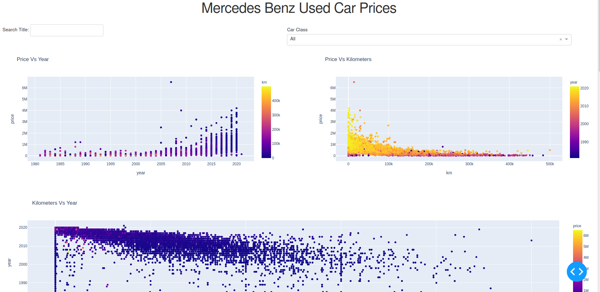

# Mercedes Benz Car Price

This repo contains used merc car prices scrapped from various sites in South Africa

Data can be found in```data/final.csv```

Data has been cleaned quite a bit, more cleaning can done via [pandas](https://pandas.pydata.org/) if need be.

There are some incorrect values which were placed on the sites, eg 0 km for the car's distance travelled, or incorrect number for the price and model name, so have a look at the data before using it.


Application uses [Ploty Dash](https://dash.plotly.com/introduction) which is a great tool to create interactive visualizations

## Usage
* Create a virtual environment ```python3 -m venv env3```

* Install packages ```pip install -r requirements.txt``

* Activate virtual environment and Run ```python app.py```



